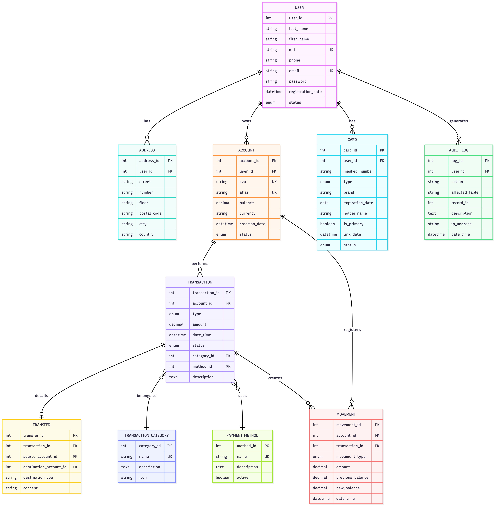

# 💳 Virtual Wallet Database System

Sistema de base de datos para una billetera electrónica desarrollado como proyecto académico para Bases de Datos III.

## 📌 Diagrama



## 📋 Descripción del Proyecto

Este proyecto implementa una base de datos completa para una billetera electrónica (similar a Mercado Pago, Ualá, etc.) que permite:

* 👤 Gestión de usuarios y cuentas
* 💰 Transacciones (transferencias, pagos, recargas, retiros)
* 💳 Vinculación de tarjetas de débito y crédito
* 📊 Reportes y análisis de gastos por categoría
* 🔐 Auditoría completa de operaciones
* 🚨 Detección de actividad sospechosa

## 🗂️ Estructura del Proyecto

```
electronic-wallet-db/
│
├── tablas.sql              # Creación de las 10 tablas del sistema
├── datos.sql               # Inserción de datos (20+ registros por tabla)
├── stored_procedures.sql   # Procedimientos ABM y consultas
├── cursores.sql           # Procedimientos con cursores
├── vistas.sql             # Vistas para reportes
├── triggers.sql           # Triggers automáticos
├── files.txt              # Documentación adicional
└── README.md              # Este archivo
```

## 🗄️ Modelo de Datos

### Tablas Principales (10)

1. **user** - Usuarios del sistema
2. **address** - Domicilios de usuarios
3. **account** - Cuentas virtuales de la billetera
4. **card** - Tarjetas vinculadas
5. **transaction** - Transacciones realizadas
6. **transfer** - Detalles de transferencias
7. **movement** - Movimientos de saldo
8. **transaction_category** - Categorías de gastos
9. **payment_method** - Métodos de pago
10. **audit_log** - Log de auditoría

### Diagrama Entidad-Relación

```
USER (1) ──── (N) ADDRESS
  │
  │ (1)
  │
  ├─── (N) ACCOUNT ──── (N) TRANSACTION ──── (1) TRANSFER
  │                          │
  │                          ├──── (1) TRANSACTION_CATEGORY
  │                          └──── (1) PAYMENT_METHOD
  │
  └─── (N) CARD
```

## 🚀 Instalación

### Requisitos Previos

* MySQL 8.0 o superior
* MySQL Workbench (opcional)
* Cliente MySQL (CLI o GUI)

### Pasos de Instalación

1. **Crear la base de datos:**

```sql
CREATE DATABASE electronic_wallet;
USE electronic_wallet;
```

2. **Ejecutar los scripts en orden:**

```bash
# 1. Crear tablas
mysql -u root -p electronic_wallet < tablas.sql

# 2. Insertar datos
mysql -u root -p electronic_wallet < datos.sql

# 3. Crear procedimientos almacenados
mysql -u root -p electronic_wallet < stored_procedures.sql

# 4. Crear procedimientos con cursores
mysql -u root -p electronic_wallet < cursores.sql

# 5. Crear vistas
mysql -u root -p electronic_wallet < vistas.sql

# 6. Crear triggers
mysql -u root -p electronic_wallet < triggers.sql
```

## 📚 Funcionalidades Implementadas

### ✅ Procedimientos Almacenados (ABM)

#### Alta (CREATE)

* `sp_create_user()` - Crear nuevo usuario
* `sp_create_transaction()` - Crear transacción

#### Baja (DELETE)

* `sp_delete_user()` - Baja lógica de usuario
* `sp_cancel_transaction()` - Cancelar transacción

#### Modificación (UPDATE)

* `sp_update_user()` - Actualizar datos de usuario

### 📊 Procedimientos de Consulta

* `sp_get_account_summary()` - Resumen de cuenta
* `sp_get_transaction_history()` - Historial de transacciones
* `sp_get_spending_by_category()` - Gastos por categoría
* `sp_get_user_activity_log()` - Log de actividad
* `sp_get_monthly_summary()` - Resumen mensual
* `sp_find_duplicate_transactions()` - Detectar posibles fraudes
* `fn_calculate_available_credit()` - Función: crédito disponible
* `fn_get_total_balance()` - Función: balance total

### 🔄 Procedimientos con Cursores

* `sp_calculate_monthly_interest()` - Calcular intereses para todas las cuentas
* `sp_generate_monthly_statements()` - Generar estados de cuenta
* `sp_block_suspicious_accounts()` - Bloquear cuentas sospechosas
* `sp_update_expired_cards()` - Actualizar tarjetas vencidas

### 👁️ Vistas (Reportes)

* `vw_user_account_overview` - Vista general de usuarios
* `vw_transaction_summary_by_user` - Resumen de transacciones
* `vw_category_spending_analysis` - Análisis de gastos
* `vw_daily_transaction_report` - Reporte diario
* `vw_active_users_with_cards` - Usuarios con tarjetas
* `vw_audit_log_summary` - Resumen de auditoría
* `vw_top_spending_users` - Ranking de gastos

### ⚡ Triggers Automáticos

* `trg_after_transaction_insert` - Crear movimiento automáticamente
* `trg_after_user_update` - Registrar cambios de usuario
* `trg_before_account_update` - Prevenir saldos negativos
* `trg_after_user_insert` - Crear cuenta automática
* `trg_before_transaction_insert` - Validar transacciones
* `trg_after_card_update` - Notificar cambios en tarjetas
* `trg_before_user_delete` - Registrar eliminaciones

## 💡 Ejemplos de Uso

### Crear un nuevo usuario

```sql
CALL sp_create_user(
    'Fernández', 
    'Roberto', 
    '40123456', 
    '+5491145678912', 
    'roberto.fernandez@email.com', 
    'hash_password',
    @user_id, 
    @message
);

SELECT @user_id, @message;
```

### Consultar resumen de cuenta

```sql
CALL sp_get_account_summary(1);
```

### Ver gastos por categoría

```sql
CALL sp_get_spending_by_category(1);
```

### Crear una transacción

```sql
CALL sp_create_transaction(
    1,                  -- account_id
    'payment',          -- type
    1500.00,           -- amount
    1,                 -- category_id
    1,                 -- method_id
    'Compra en supermercado',
    @transaction_id,
    @message
);
```

### Consultar vistas

```sql
-- Ver usuarios activos con tarjetas
SELECT * FROM vw_active_users_with_cards;

-- Ver top usuarios con más gastos
SELECT * FROM vw_top_spending_users;

-- Ver análisis por categoría
SELECT * FROM vw_category_spending_analysis;
```

## 🔐 Características de Seguridad

* ✅ Validación de saldos antes de transacciones
* ✅ Prevención de saldos negativos mediante triggers
* ✅ Auditoría completa en `audit_log`
* ✅ Detección de actividad sospechosa
* ✅ Transacciones protegidas con COMMIT/ROLLBACK
* ✅ Constraints para integridad referencial

## 🎯 Requisitos Académicos Cumplidos

* ✅ **10 tablas** con relaciones
* ✅ **20+ registros** por tabla
* ✅ **Constraints** (PK, FK, CHECK, UNIQUE)
* ✅ **3+ procedimientos ABM** (5 implementados)
* ✅ **3+ procedimientos de consulta** (8 implementados)
* ✅ **1+ cursor** (4 implementados)
* ✅ **3+ vistas** (7 implementadas)
* ✅ **1+ trigger** (7 implementados)
* ✅ **Transacciones con COMMIT/ROLLBACK**
* ✅ **Nomenclatura en inglés y minúscula**

## 👨‍💻 Autor - Esteban Hirzfeld

**Segundo Parcial - Bases de Datos III**

* Institución: Escuela Da Vinci
* Materia: Bases de Datos III
* Año: 2025
